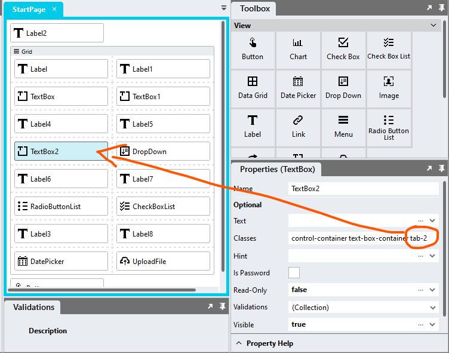

# Form Fields Tab Order

Data capturing is quicker if the user does not have to select form fields using their mouse and can tab through the fields instead. This module allows you to set up a custom tab order for form fields. 

## Version 
1.0 - initial

# Setup

## Global Script
1. Create a Global Script called "TabOrder"
2. Add the input parameters below to the Global Script
3. Drag a *JavaScript* action into the script
4. Add the Javascript below into the JavaScript code property
```javascript
/* Stadium Script v1.0 https://github.com/stadium-software/form-fields-tab-order */
let tabFields = document.querySelectorAll("[class*=tab-]");
for (let i = 0; i < tabFields.length; i++) {
    let classes = tabFields[i].getAttribute("class").split(" ");
    let tab = classes.filter(getClass);
    let order = parseInt(tab[0].split("-")[1]);
    let inputs = tabFields[i].querySelectorAll("input, select, textarea, button:not(.datepicker-btn)");
    for (let j = 0; j < inputs.length; j++) {
        inputs[j].setAttribute("tabIndex", order);
    }
}
tabFields[0].querySelector("input, select, textarea, button").focus();
document.onkeyup = (e) => {
    if (e.keyCode === 9) {
        let container = e.target.closest(".control-container"),
            tab;
        if (container) {
            let classes = container.getAttribute("class").split(" ");
            tab = classes.filter(getClass);
        }
        if (!tab) {
            tabFields[0].querySelector("input, select, textarea, button").focus();
        }
    }
};
function getClass(cl) {
    return cl.startsWith("tab-");
}
```

## Page
1. Drag form fields to the page (e.g. CheckBox, CheckBox List, Date Picker, Drop Down, Radio Button List, Text Box or Upload File)
2. Add classes to the fields that will define the tab order (e.g. tab-1, tab-2, tab-3, etc)



## Page.Load
1. Drag the "TabOrder" Global Scripot into the event handler